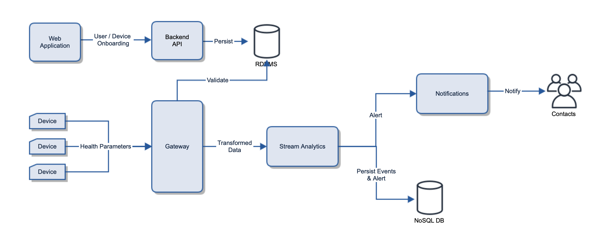
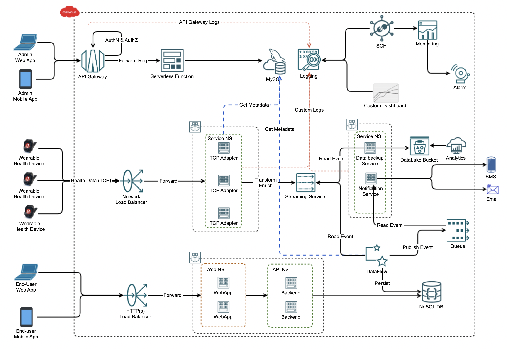
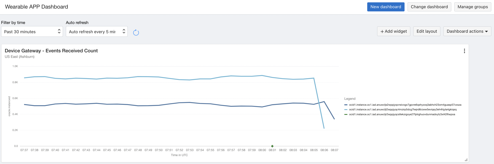

# oci-wearable-health-app

[](https://img.shields.io/badge/license-UPL-green) [](https://sonarcloud.io/dashboard?id=oracle-devrel_oci-wearable-demo)

## Introduction

The sample application is an IoT use-case, in which an application capturing health parameters running on a wearable device is sending health statistics to a device gateway (backend) hosted on OCI on regular intervals.
The complete use-case can be split into 3 different parts:
* On-boarding and Administration: As the device is bought by an end-user, the device is on-boarded and activated on the system via a mobile app or a web app. The mobile / web-app calls REST endpoints that are front-ended by an API Gateway. The REST endpoints are hosted on serverless functions and are responsible for activating the device on the system, adding a user into system, mapping the end-user with the device, defining alert thresholds of a user, amongst other functionalities.
* Health data capturing & Real time Analytics - The data captured by the health devices is sent to a public end-point exposed via a network load balancer. The NLB forwards the request to device gateway, which transform the raw TCP data into more meaningful format like JSON and also enrich it with the user / contextual information. These TCP adapters are deployed over OKE. The transformed data is pushed into OCI Streaming service for further processing. There can be multiple consumers reading these events from the streaming service

  * Backup Service - writing data into a data lake for analytics, this is the transformed & enriched payload, which is kept for long term duration.
  * Dataflow job - Spark job doing near real-time analytics like any threshold breach. This jobs also pushes the payload & generated alerts into time-series DB (e.g. OCI's NoSQL DB service). This persisted data can be served by REST endpoints on an end-user application. The generated alerts are also pushed to a queue, which is consumed by the Notification Service (running on OKE), the notification service is responsible for sending the alerts to the intended user via different channels like SMS / Email.

* Batch Analytics - The data stored in the data lake bucket can be processed using OCI Big DataService, that can aggregate data over different dimensions and time durations. This aggregated data can then be rendered on dashboards for use by OEM, end-users or medical practitioners.





## Getting Started

Before you deploy this demo application, make sure you have

* Access to the OCI tenancy.

* Have the permissions and quota available to manage the required resources.

* Have got access to the Queue service since it's still in LA.

## URLs

[Terraforn Repo](https://github.com/oracle-devrel/terraform-oci-wearable-health-app) that can be used to setup the complete solution in your tenancy.

## OCI services used to build this solution

### API Gateway

The API Gateway service enables you to publish APIs with private endpoints that are accessible from within your network, and which you can expose with public IP addresses if you want them to accept internet traffic. Follow for more info on [API gateway](https://docs.oracle.com/en-us/iaas/Content/APIGateway/Concepts/apigatewayoverview.htm).
In this demo we use the API Gateway to expose the REST endpoints and configure authentication on the endpoints exposed.

### OCI Functions

[Oracle Functions](https://docs.oracle.com/en-us/iaas/Content/Functions/Concepts/functionsoverview.htm) is a fully managed, multi-tenant, highly scalable, on-demand, Functions-as-a-Service platform. It is built on enterprise-grade Oracle Cloud Infrastructure and powered by the Fn Project open source engine.
In this sample app we use functions to create REST endpoints. We also use a function configured with API Gateway to validate authentication headers.

### Object Storage

The Oracle Cloud Infrastructure [Object Storage](https://docs.oracle.com/en-us/iaas/Content/Object/Concepts/objectstorageoverview.htm) service is an internet-scale, high-performance storage platform that offers reliable and cost-efficient data durability. The Object Storage service can store an unlimited amount of unstructured data of any content type, including analytic data and rich content, like images and videos.
We use Object storage to host the static UI for the application which makes REST calls to the endpoints exposed by the API Gateway.

### Mysql DB

[MySQL](https://docs.oracle.com/en-us/iaas/mysql-database/doc/mysql-database-service-overview.html) Database Service is a fully managed Oracle Cloud Infrastructure native service, developed, managed, and supported by the MySQL team in Oracle.
Oracle automates tasks such as backup and recovery, and database and operating system patching. You are responsible solely for managing your data, schema designs, and access policies.

We use Mysql to store the Users, User Preferences and Device data.

### OKE

Oracle Cloud Infrastructure [Container Engine](https://docs.oracle.com/en-us/iaas/Content/ContEng/Concepts/contengoverview.htm) for Kubernetes is a fully-managed, scalable, and highly available service that you can use to deploy your containerized applications to the cloud.

We deploy the IOT gateway and the notification application on the OKE and use the autoscaling feature to scale the pods when load on the application increases.

### Streaming service

The Oracle Cloud Infrastructure [Streaming service](https://docs.oracle.com/en-us/iaas/Content/Streaming/Concepts/streamingoverview.htm) provides a fully managed, scalable, and durable solution for ingesting and consuming high-volume data streams in real-time.

We use streaming service to injest real-time stream of events sent by devices to the gateway. Gateway publishes these events to the Stream which are processed by the Data Flow application.

### Queue service

Highly available messaging service build to support cases like application decoupling and scaling in a micro services architecture. This is a point-to-point messaging service which provides at most once processing of the messages.

The Data flow application raises the alerts based on the analytics performed on the stream of events. These alerts are pushed to Queue to decouple the Data flow application and the notification application whose sole purpose is to send Emails on consuming these alerts.

### Email Service

Oracle Cloud Infrastructure [Email Delivery](https://docs.oracle.com/en-us/iaas/Content/Email/home.htm) is an email sending service and SMTP relay that provides a fast and reliable managed solution for sending both high volume bulk and transactional emails that need to reach the inbox.

Notification application sends out the mails using the Email delivery service on receiving the alert events. [Oracle Notification Service](https://docs.oracle.com/en-us/iaas/Content/Notification/home.htm) is another service available in OCI which can send the emails, but is more suited for use cases where we have low throughputs like in case of events raised by monitoring alarms or event rules.

### NoSql DB

A [NoSQL database](https://docs.oracle.com/en-us/iaas/nosql-database/index.html) service offering on-demand throughput and storage based provisioning that supports JSON, Table and Key-Value datatypes, all with flexible transaction guarantees.

In our demo application we use the NoSqlDB to store the raw events which are received by the IOT gateway application. NoSql provides us with the flexibility to store raw events which can be of different schema types.

### SCH

[Service Connector Hub](https://docs.oracle.com/en-us/iaas/Content/service-connector-hub/overview.htm) is a cloud message bus platform that offers a single pane of glass for describing, executing, and monitoring movement of data between services in Oracle Cloud Infrastructure.

The application uses SCH to move events coming on the Stream to the Object Storage, where those are persisted for long term duration.

### Network Load Balancer (NLB)

The Device Gateway (TCP Server) is front-ended by a [Network Load Balancer](https://docs.oracle.com/en-us/iaas/Content/NetworkLoadBalancer/overview.htm), which is responsible for distribution of traffic. The device gateway is deployed on OKE using K8s service type as Load Balancer.

The deployment manifest of TCP Server component automatically spins-up a NLB, configures the backend routing policy and the network security list, using the following annotations

``` Java
    oci.oraclecloud.com/load-balancer-type: "nlb"
    oci-network-load-balancer.oraclecloud.com/backend-policy: "FIVE_TUPLE"
    oci-network-load-balancer.oraclecloud.com/security-list-management-mode: "All"
```

### UMA and Custom Dashboards

[Unified Monitoring Agents](https://docs.oracle.com/en-us/iaas/Content/Logging/Concepts/agent_management.htm) are used To ingest events from the applications into a custom log. This agent allows you to control exactly which logs you want to collect, how to parse them, and more. 

Using [Logging Query Language](https://docs.oracle.com/en-us/iaas/Content/Logging/Reference/query_language_specification.htm), the ingested logs are viewed by creating Custom Dashboards.



### Developer Tools

[DevOps Service](https://docs.oracle.com/en-us/iaas/Content/devops/using/getting_started.htm) in OCI is an end-to-end, continuous integration and continuous delivery (CI/CD) platform for developers. Use this service to easily build, test, and deploy software and applications on Oracle Cloud.

The application is using features like Build & Deployment pipelines, Triggers, Artifacts and Environments for implementing CI/CD process.

### Prerequisites

* Permission to `manage` the following types of resources in your Oracle Cloud Infrastructure tenancy: `vcns`, `OSS`, `Kubernetes cluster`, `API gateway`, `functions`, `Mysql DB`, `NoSqlDB`, `Email Delivery`, `object storage` and `instances`.

* Quota to create the following resources: 2 VCNs, 1 MysqlDB, 1 NoSql DB, 1 API Gateway, 1 function Application, 2 functions, 1 K8 cluster, 1 stream, 1 queue, 1 Data Flow Application and 1 compute instance.

If you don't have the required permissions and quota, contact your tenancy administrator. See [Policy Reference](https://docs.cloud.oracle.com/en-us/iaas/Content/Identity/Reference/policyreference.htm), [Service Limits](https://docs.cloud.oracle.com/en-us/iaas/Content/General/Concepts/servicelimits.htm), [Compartment Quotas](https://docs.cloud.oracle.com/iaas/Content/General/Concepts/resourcequotas.htm).

## Notes/Issues

The OCI Queue service being used in the solution is currently in LA and will soon be GA. Please follow the OCI News for the latest updates.
One can get access to the LA feature by contacting support.

## Contributing

This project is open source.  Please submit your contributions by forking this repository and submitting a pull request!  Oracle appreciates any contributions that are made by the open source community.

## License

Copyright (c) 2024 Oracle and/or its affiliates.

Licensed under the Universal Permissive License (UPL), Version 1.0.

See [LICENSE](LICENSE) for more details.

ORACLE AND ITS AFFILIATES DO NOT PROVIDE ANY WARRANTY WHATSOEVER, EXPRESS OR IMPLIED, FOR ANY SOFTWARE, MATERIAL OR CONTENT OF ANY KIND CONTAINED OR PRODUCED WITHIN THIS REPOSITORY, AND IN PARTICULAR SPECIFICALLY DISCLAIM ANY AND ALL IMPLIED WARRANTIES OF TITLE, NON-INFRINGEMENT, MERCHANTABILITY, AND FITNESS FOR A PARTICULAR PURPOSE.  FURTHERMORE, ORACLE AND ITS AFFILIATES DO NOT REPRESENT THAT ANY CUSTOMARY SECURITY REVIEW HAS BEEN PERFORMED WITH RESPECT TO ANY SOFTWARE, MATERIAL OR CONTENT CONTAINED OR PRODUCED WITHIN THIS REPOSITORY. IN ADDITION, AND WITHOUT LIMITING THE FOREGOING, THIRD PARTIES MAY HAVE POSTED SOFTWARE, MATERIAL OR CONTENT TO THIS REPOSITORY WITHOUT ANY REVIEW. USE AT YOUR OWN RISK.
